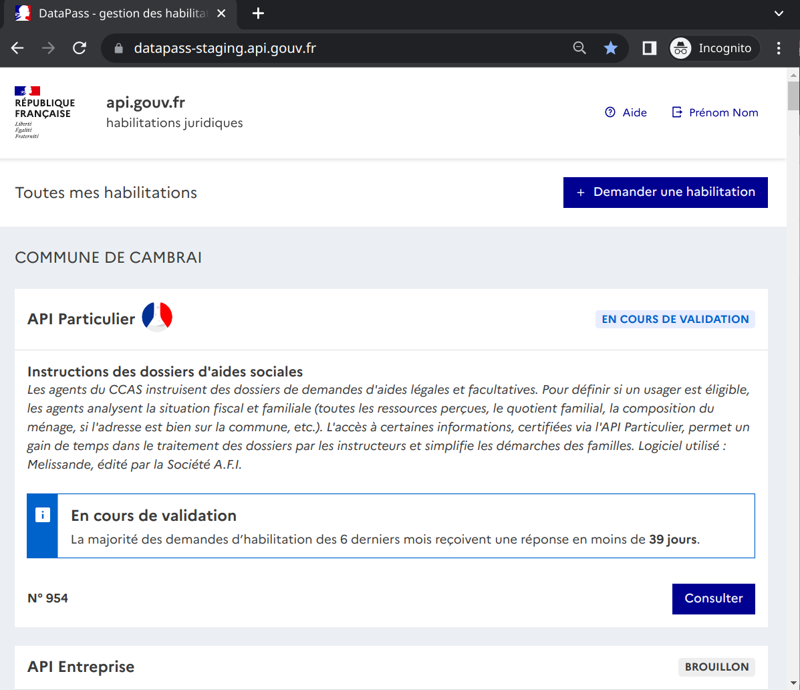

# ⚠️ Ce dépôt n'est plus maintenu, il est remplacé par une nouvelle version disponible sur: [etalab/data_pass](https://github.com/etalab/data_pass)

---

# DataPass [](https://github.com/betagouv/datapass/actions/workflows/front.yml) [](https://github.com/betagouv/datapass/actions/workflows/back.yml)

L’outil de gestion des habilitations juridiques pour les données à accès restreint.



## Contexte

### Le problème

Lorsqu’une administration expose des données à caractère personnel, elle doit pouvoir interdire leur diffusion aux organisations qui n’ont pas le droit d’y accéder. Par exemple, une agence de voyage n’a pas à connaître le revenu fiscal de référence de ses clients.

Pour cela, la plupart des administrations qui fournissent des données demandent aux entités souhaitant exploiter ces données de signer des conventions pour organiser l’échange.

Mais comment les collectivités territoriales peuvent-elles, dans ces conditions, avoir accès au fameux revenu fiscal de référence sachant qu’elles sont par ailleurs tenues de ne plus de demander ces informations à leurs administrés (cf. [Article L114-8 du CRPA](https://www.legifrance.gouv.fr/affichCode.do;jsessionid=EA87CA618644F6B9C1A66E4468F81BFD.tplgfr38s_3?idSectionTA=LEGISCTA000031367410&cidTexte=LEGITEXT000031366350&dateTexte=20161009)) ?

Doivent-elles signer des conventions avec chacune des administrations productrices de données avec potentiellement des règles et des procédures différentes chez chacun ? Il est probable que la multiplicité des conventions aboutissent purement et simplement à la non-circulation des données. Ceci implique in-fine que chaque citoyen doit continuer à fournir une photocopie de son avis d’imposition à sa mairie pour remplir ses démarches administratives annuelles.

### La solution

La DINUM simplifie radicalement ce processus. Dans un premier temps, elle a travaillé sur la mise en place d’un cadre juridique commun pour harmoniser et fluidifier les relations entre fournisseurs de données et fournisseurs de service. C’est la mise en place de l’article de la section [« Échange de données entre administrations » (L114-8 et suivants) du CRPA](https://www.legifrance.gouv.fr/affichCode.do;jsessionid=EA87CA618644F6B9C1A66E4468F81BFD.tplgfr38s_3?idSectionTA=LEGISCTA000031367410&cidTexte=LEGITEXT000031366350&dateTexte=20161009).

Dans un deuxième temps, la DINUM a mis en place un outil pour faciliter cette mise en relation entre fournisseur et consommateur : DataPass. Cet outil s’adresse aux ayants droits qui souhaiteraient exploiter des données à caractère personnel. DataPass délivre des habilitations, à travers un parcours simple, standardisé et conforme, pour accéder à l’ensemble des données protégées produites par l’État.

Le code de cet outil est [ouvert](https://guides.etalab.gouv.fr/logiciels/#clarifier-quels-degres-d-ouverture-pour-les-codes-sources).

## Raccorder son service à DataPass

### Déploiement du formulaire

Pour ajouter un formulaire voici la liste des fichiers à modifier :

1. dans le frontend
   1. description de l’organisation du formulaire (création de [frontend/src/pages/NameOfApi.js](/frontend/src/pages/FranceConnect.js))
   2. label, icône, email de contact ([frontend/src/config/data-provider-parameters.tsx](/frontend/src/config/data-provider-configurations.tsx))
   3. [optionnel] codes organisation (codes NAF) valides pour votre service ([frontend/src/lib](frontend/src/lib/index.js#L57-L60))
   4. [optionnel] une page de présentation hors connection
   5. [optionnel] une liste de démarches pré-remplies
2. dans le backend
   1. définition des données spécifiques autorisées (création de
      backend/app/policies/enrollment/<name_of_api>\_policy.rb)
   2. définitions de règles de validation spécifiques (création de backend/app/models/enrollment/<name_of_api>.rb)
   3. configuration du label de service et de l’adresse email pour les notifications mails émises
      depuis DataPass [data\_providers](backend/config/data_providers/)
   4. [optionnel] configuration d’un Webhook DataPass
   5. [optionnel] modèle d’email de réponse personnalisé

### Interfaçage entre DataPass et un API Manager

[](https://docs.google.com/drawings/d/1FUd7ko-7GkMyy_JwqLBtjswQO_lycUg3591WRZSx8hw/edit?usp=sharing)

## Les roles dans DataPass

Dans DataPass, il y a différents types d’utilisateurs :

- **les demandeurs :** ils viennent déposer leur demande d’accès, ils n’ont accès qu’a leurs habilitations.
- **les instructeurs :** ils peuvent valider, refuser ou demander des modifications des demandes d’habilitations qu’ils
  ont à charge.
- **les rapporteurs :** ils voient, en plus de leurs propres habilitations, toutes les habilitations relatives à
  leur service.
- **les abonnés :** ils reçoivent une notification par mail à chaque fois qu’un demandeur dépose une
  nouvelle demande d’habilitation pour leur service.

Ces types sont combinables pour débloquer plus ou moins de fonctionnalités : par exemple un utilisateur qui
serait à la fois « rapporteur » et « abonné » pour une API donnée, est notifié par email d’une nouvelle
demande d’habilitation pour cette API et peut consulter la demande d’habilitation en question. Pour autant, il ne peut pas la valider.

À noter que les instructeurs, rapporteurs et abonnés ont une page d’accueil différente des demandeurs.
Cette page d’accueil ajoute notamment des fonctions de recherche et de filtre des habilitations qui ne sont pas
disponibles aux demandeurs.

Pour devenir instructeur, rapporteur ou abonné pour un type d’habilitation il faut :

1. s’identifier avec ProConnect (https://www.proconnect.gouv.fr/)
2. rejoindre l’organisation que l’on représente en renseignant son numéro SIRET
3. envoyer une demande écrite à datapass@api.gouv.fr

## Tester DataPass

Si vous avez besoin de faire le parcours de validation complet pour bien comprendre le fonctionnement
de DataPass, vous pouvez utiliser notre plateforme de « staging ». Cette plateforme est disponible ici :
https://staging.api-entreprise.v2.datapass.api.gouv.fr/ (lien direct vers une demande d’habilitation API Particulier :
https://staging.api-particulier.v2.datapass.api.gouv.fr/).

Vous pouvez vous créer un compte utilisateur en entrant n’importe quel numéro SIRET.

Vous pouvez également utiliser les comptes de tests suivants :

- instructeur API Entreprise :
  - identifiant : api-entreprise@yopmail.com
  - mot de passe : api-entreprise@yopmail.com
- instructeur API Particulier :
  - identifiant : api-particulier@yopmail.com
  - mot de passe : api-particulier@yopmail.com
- utilisateur sans droits :
  - identifiant : user@yopmail.com
  - mot de passe : user@yopmail.com

À noter que les emails reçus sur les adresses en yopmail.com sont accessibles sur : http://yopmail.com/.

## Contenu de ce dépôt de code

Ce dépôt de code vous permet d’instancier un environnement de développement local pour DataPass.
Pour ce faire merci de prendre connaissance de la suite du document (en anglais).

## Ajouter une nouvelle source de données

Se référer à [Ajout d'un nouveau fournisseur](./backend/docs/new_enrollment.md)

## Development

### Requirements

- ruby 3.2.2
- node ~16
- redis
- postgresql 12.11

### Installation

```sh
./bin/install.sh
```

### Run

```sh
./bin/local_dev.sh
```

Check [frontend/README.md] and [backend/README.md] if you need to run only one
of them

### DataPass back & front with Docker

This installation method use a backend launched locally with docker. This method
is longer and more complex than the first method, but you will be able to make
development on the backend.
This installation is compatible with MacbookPro M1.

#### Dependencies setup

- [Docker 20.10.8](https://www.docker.com/)
- [Docker compose 1.29.2](https://docs.docker.com/compose/install/)
- [NodeJS 16](https://nodejs.org/)

#### Local environment

Clone the repo:

```bash
git clone git@github.com:betagouv/datapass.git
cd datapass
```

Ask a colleague to give you the backend secrets stored in
the `backend/.env.local` file.

Then create and configure your backend docker containers:

```bash
docker-compose up # This can take a while, go make a loaf of bread or something
```

And finally, you can start the frontend:

```bash
cd frontend
npm install
npm run dev
```

#### Test your installation

Go to http://localhost:3000/. Sign in as `user@yopmail.com` with the
password `user@yopmail.com`. Then, you should see the enrollment list. Note that
test instructor emails can be
found [here](https://github.com/betagouv/moncomptepro/blob/master/scripts/fixtures.sql)
.

#### Front end linter

Note that, we use the [`prettier`](https://prettier.io) linter for datapass-frontend.
Please configure your IDE accordingly: https://prettier.io/docs/en/editors.html.

### DataPass back & front with Vagrant (optional)

This installation method use a backend launched locally within a Vagrant virtual
machine. This method is much longer and more complex than the previous ones, but
it provides a development environment very close to the production environment
allowing you to both work on provisioning and applications. It is configured to
run with a local installation of moncomptepro in a Vagrant virtual machine.

For details on this installation follow instructions here: https://gitlab.com/etalab/api.gouv.fr/datapass-infrastructure/-/blob/master/README.md
Ask a colleague to give you access to the Gitlab Infratrusture repository.

## Global architecture

### Functional architecture

[](https://docs.google.com/drawings/d/11sVVz73uL1GBST5q1iykPQ40CgaN33MhETPeHesmslI/edit?usp=sharing)

### Technical architecture

[](https://docs.google.com/drawings/d/1rJl6g-BFKO--4EWmbSgn3Wq7H8LCxDUvey_xlN-3Sp4/edit?usp=sharing)

Powered
by: [](https://www.browserstack.com/)

## Deployment

### Staging

```sh
./bin/deploy-staging.sh
```
