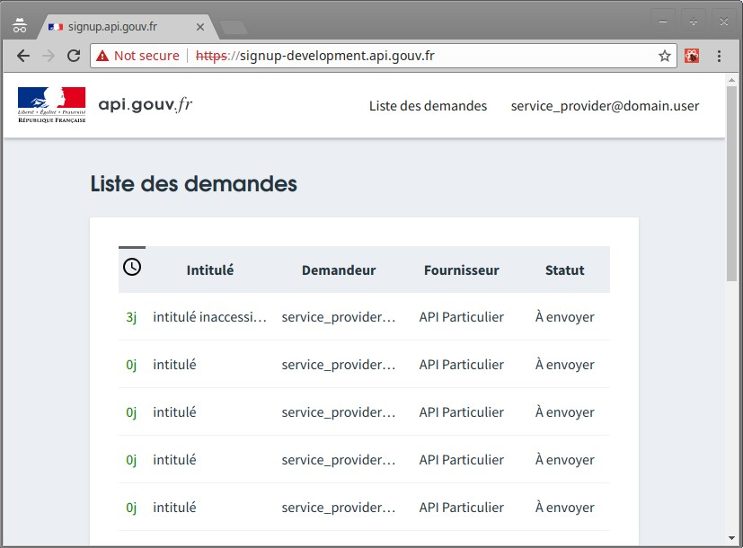

# Signup

Dépôt ansible pour déployer les services [api.gouv.fr](https://api.gouv.fr).



Ces scripts ansible permettent de gérer :

- signup.api.gouv.fr : l'application de contractualisation des APIs de api.gouv.fr
- scopes.api.gouv.fr : le référentiel des périmètres de données autorisés par signup
- auth.api.gouv.fr : le SSO des services [api.gouv.fr](https://api.gouv.fr)

## Install

### Dependencies setup

- [VirtualBox \^5.2.10](https://www.virtualbox.org)
- [Vagrant \^2.1.1](https://www.vagrantup.com)
- NFS
- [Ansible 2.5.0](https://www.ansible.com/) or `brew install ansible` (this may take a while)
- dnspython

For more information, see https://gitlab.incubateur.net/beta.gouv.fr/api-particulier-ansible#dependencies-setup
(if this goes to a `404`, ask a teammate to allow your profile on the project.)

### Signup local provisioning

Clone the repo:

```bash
git clone --recursive git@gitlab.incubateur.net:beta.gouv.fr/signup-ansible.git
cd signup-ansible/
git submodule foreach git fetch
git submodule foreach git pull origin master
git submodule foreach git checkout master
```

Some sensitive information are encrypted in ansible's vault. To read it you will need to set the vault password.

Ask a teammate for the password. Put it in `~/.ssh/ansible_vault`.

Add the following hosts in `/etc/hosts`:

```text
192.168.56.125 signup-development.particulier-infra.api.gouv.fr
192.168.56.125 signup-development.api.gouv.fr
192.168.56.125 back.signup-development.api.gouv.fr

192.168.56.126 scopes-development.particulier-infra.api.gouv.fr
192.168.56.126 scopes-development.api.gouv.fr

192.168.56.127 auth-development.particulier-infra.api.gouv.fr
192.168.56.127 auth-development.api.gouv.fr
```

Then install ansible dependencies: 

```bash
ansible-galaxy install -r requirements.yml # install `ansible roles`: https://docs.ansible.com/ansible/latest/user_guide/playbooks_reuse_roles.html
```

> **If you are using macOS.**
> The host's `/etc/hosts` configuration file may not take effect in the guest machines.
> You might need to also alter the guest machine's `/etc/hosts` after running vagrant up.

Then configure your virtual machine: 
```bash
vagrant up
ANSIBLE_HOST_KEY_CHECKING=False ansible-playbook -i inventories/development/hosts configure.yml # This can take a while, go make a loaf of bread or something
```

### Development deployment

Deploy Signup backend:
```bash
vagrant ssh signup
sudo su - signup
cd /opt/apps/signup-back/current
export $(cat /etc/signup-back.conf | xargs)
bundler install
eval "$(rbenv init -)"
rails db:migrate
rails db:seed
rails db:fixtures:load
sudo systemctl restart signup-back
exit
exit
```

Deploy Signup frontend:
```bash
vagrant ssh signup
sudo su - signup
cd /opt/apps/signup-front/current
export $(cat /etc/signup-front.conf | xargs)
npm i
npm run build
sudo systemctl restart signup-front
exit
exit
```

Deploy API Scopes:
```bash
vagrant ssh api-scopes
sudo su - api-scopes
cd /opt/apps/api-scopes/current
export $(cat /etc/api-scopes.conf | xargs)
npm i
npm run build
sudo systemctl restart api-scopes
exit
exit
```

Deploy API Auth:
```bash
vagrant ssh api-auth
sudo su - api-auth
cd /opt/apps/api-auth/current
export $(cat /etc/api-auth.conf | xargs)
npm i
npm run build
 # load fixtures
npm run load-fixtures
sudo systemctl restart api-auth
exit
exit
```

### Test your installation

Go to https://signup-development.api.gouv.fr/. Sign in as service_provider@domain.user:password . You should see the enrollment list. Note that other credentials can be found [here](TODO commit link to credential list)

> if you want to install API Particulier, you may now resume on [testing API Particulier installation](https://gitlab.incubateur.net/beta.gouv.fr/api-particulier-ansible#test-the-local-installation).

### Run app manually (optional)

If you want to launch interactively signup-front:
```bash
vagrant ssh signup
sudo systemctl stop signup-front
sudo su - signup
cd /opt/apps/signup-front/current
export $(cat /etc/signup-front.conf | xargs)
npm run dev
```

If you experience trouble reloading, you might want to increase the file watcher limit in both the host and the guest: https://webpack.js.org/configuration/watch/#not-enough-watchers .

Note that, we use the [`prettier`](https://prettier.io) linter for signup-front. Please configure your IDE accordingly: https://prettier.io/docs/en/editors.html.

signup-back:
```bash
vagrant ssh signup
sudo systemctl stop signup-back
sudo su - signup
cd /opt/apps/signup-back/current
export $(cat /etc/signup-back.conf | xargs)
RAILS_ENV=development rails s
```

api-scopes:
```bash
vagrant ssh api-scopes
sudo systemctl stop api-scopes
sudo su - api-scopes
cd /opt/apps/api-scopes/current
export $(cat /etc/api-scopes.conf | xargs)
npm start
```

api-auth:
```bash
vagrant ssh api-auth
sudo systemctl stop api-auth
sudo su - api-auth
cd /opt/apps/api-auth/current
export $(cat /etc/api-auth.conf | xargs)
npm start
```

### Production-like deployment

For development purpose you may want to have a local iso-production application running. You can do it by running the deployment script instead of processing to a development deployment:

```bash
ANSIBLE_HOST_KEY_CHECKING=False ansible-playbook -i inventories/development/hosts deploy.yml
```

## Deploy to staging

### Provisioning

See https://gitlab.incubateur.net/beta.gouv.fr/api-particulier-ansible#configure-staging-instance

### Deployment

#### Deploy staging instance

Use the following command to deploy signup-front, signup-back, api-scopes & api-auth:
```bash
ansible-playbook -i inventories/staging/hosts deploy.yml
```

Use the following command to deploy <app_name> only (app_name can be one of : front, back, api-scopes, api-auth):
```bash
ansible-playbook -i inventories/staging/hosts deploy.yml -t <app_name>
```

#### Deploy production instance

Use the following command to deploy signup-front, signup-back, api-scopes & api-auth:
```bash
ansible-playbook -i inventories/production/hosts deploy.yml
```

Use the following command to deploy <app_name> only (app_name can be one of : front, back, api-scopes, api-auth):
```bash
ansible-playbook -i inventories/production/hosts deploy.yml -t <app_name>
```

## Create admin user on staging

> NB: the procedure is the same on the production environment

Connect to the staging server:
```bash
ssh ubuntu@signup-staging.particulier-infra.api.gouv.fr
```

Connect to the database:
```bash
sudo su - api-auth
psql -U api-auth -d api-auth -W -h 127.0.0.1
# get the password from ansible vault
```

Then grant the user by modifying the user in the database:
```postgres-sql
update users set legacy_account_type = 'api_particulier' where email='raphael.dubigny@beta.gouv.fr';
```

legacy_account_type can be 'franceconnect' or 'dgfip'. More values are available [here](https://github.com/betagouv/signup-back/blob/1bd0da6c82d7a368d62283a236e4bb057c4c69d3/app/models/enrollment.rb#L17).

The user must then logout and login again.

## Enable login to new application to login via api-auth on staging

To enable login to a new application via api-auth, you must declare the application as a new oidc client.

> NB: the procedure is the same on the production environment

Connect to the staging server:
```bash
ssh ubuntu@signup-staging.particulier-infra.api.gouv.fr
```

Connect to the database:
```bash
sudo su - api-auth
psql -U api-auth -d api-auth -W -h 127.0.0.1
# get the password from ansible vault
```

Then grant the user by modifying the user in the database:
```postgres-sql
INSERT INTO oidc_clients (name, client_id, client_secret, redirect_uris)
VALUES ('application_name', 'client_id', 'client_secret', '{"https://redirect.uri/callback"}');
```

Here is a suggestion on how to generate client_id and client_secret: https://stackoverflow.com/a/34350507/2590861 .

## Configue Matomo (ex Piwik)

To follow the usage of the project, we use a Matomo instances hosted [here](http://stats.data.gouv.fr/index.php?module=CoreHome&action=index&idSite=53&period=range&date=previous30#?module=Dashboard&action=embeddedIndex&idSite=53&period=range&date=previous30&idDashboard=1)
The production configuration can be found in `./inventories/production/group_vars/front.yml`

## Play with API Scopes

As there is no fixtures in API Scopes' database, we detail here the way to add some.

You create an entry with the following commands:
```bash
vagrant ssh api-scopes
mongo scopes-development.api.gouv.fr:27017/scopes -u signup -p signup --eval "db.scopes.insert({client_id: '12',provider:'api-particulier',scopes:['dgfip_avis_imposition', 'dgfip_adresse'],signup_id: '1'})"
```

Then, you can query this entry with `curl -k -H 'x-provider: api-particulier' https://scopes-development.api.gouv.fr/api/scopes/12`.
